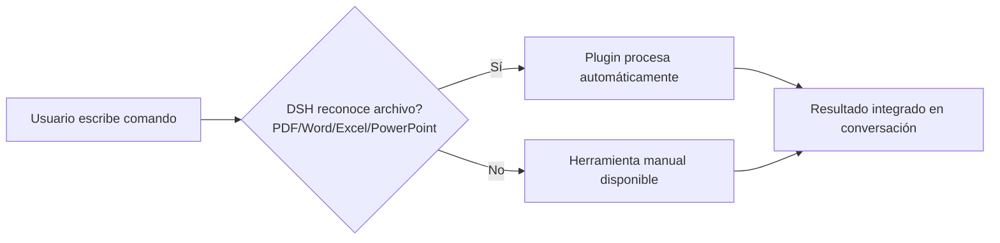
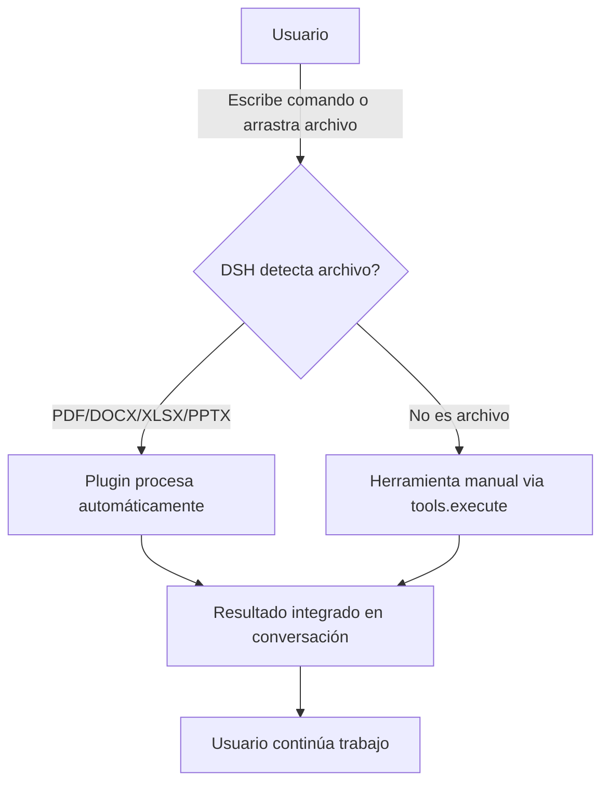

# 🌟 Office Suíte DSH

> **Plugin profesional para DeepSeek Harness (DSH)**
> Trabaja con archivos de ofimática: PDF, Word, Excel, PowerPoint — leer, crear, modificar, convertir.

```markdown
[](https://nodejs.org)
[](https://github.com/deepseek-ai/dsh)
[](LICENSE)
[]()
```

---

## 📋 ¿Qué es?

**Office Suíte DSH** es un plugin de integración para DSH que proporciona **16 herramientas profesionales** para trabajar con documentos de ofimática. No es un visor externo: es parte nativa de tu entorno DSH.

### 🎯 Filosofía de trabajo



---

## ✨ Características Visuales

| Icono | Función | Descripción |
|:-----:|:-------:|:-----------|
| 📄 | **PDF** | Leer contenido, crear nuevos, modificar, combinar, extraer páginas |
| 📝 | **Word** | Leer DOCX, crear con formato, modificar, convertir a HTML/texto |
| 📊 | **Excel** | Leer XLSX, crear hojas, modificar datos, convertir CSV |
| 🎯 | **PowerPoint** | Crear presentaciones, plantillas, notas del presentador |

---

## 🚀 Instalación Rápida (1 comando)

```bash
# Desde cualquier directorio con DSH instalado
node install-global.js

# O con npm
npm run install-global
```

### Resultado esperado

```
✅ DSH encontrado en: C:\Users\...\.dsh
✅ Plugin instalado globalmente
✅ Configuración actualizada (dsh.config.yml)
✅ Dependencias instaladas (108 paquetes)
✅ 16 herramientas disponibles
```

---

## 🛠️ Las 16 Herramientas

```
read_pdf            → Leer PDF
create_pdf          → Crear PDF
modify_pdf          → Modificar PDF
merge_pdfs          → Combinar PDFs
extract_pdf_pages   → Extraer páginas

read_word           → Leer Word
create_word         → Crear DOCX
modify_word         → Modificar DOCX
word_to_text        → DOCX → TXT
word_to_html        → DOCX → HTML

read_excel          → Leer XLSX → JSON
create_excel        → Crear XLSX
modify_excel        → Modificar XLSX
excel_to_csv        → XLSX → CSV
csv_to_excel        → CSV → XLSX
read_excel_cell     → Leer celda específica
get_excel_stats     → Estadísticas Excel

create_powerpoint           → PPTX completo
create_simple_powerpoint    → PPTX simple
create_powerpoint_from_template → Plantillas
get_powerpoint_info         → Info de capacidades
```

---

## 💡 Ejemplo Rápido

```javascript
// En la consola de DSH
await tools.execute('create_pdf', {
  file_path: './informe.pdf',
  title: 'Informe Mensual',
  content: 'Contenido del informe...',
  author: 'Equipo DSH'
});
```

---

## 🔗 Workflow del Plugin



---

## 📁 Estructura del Proyecto

```
office-suite-dsh/
├── src/
│   ├── index.js              → Plugin principal (620 líneas, 16 herramientas)
│   ├── pdf-tools.js          → Lectura/creación/modificación PDF
│   ├── word-tools.js         → DOCX: lectura, creación, conversión
│   ├── excel-tools.js        → XLSX: lectura, creación, estadísticas
│   └── powerpoint-tools.js   → PPTX: creación, plantillas
├── tests/
│   └── basic-tests.js        → Suite automatizada
├── install-global.js         → Instalador automático (único comando)
├── install.js                → Instalador local
├── examples.js               → 12 ejemplos prácticos
└── package.json
```

---

## 🧪 Pruebas Incluidas

Ejecutar: `npm test` o `node tests/basic-tests.js`

- ✅ Crear/leer PDF
- ✅ Crear/leer Word
- ✅ Crear/leer/modificar Excel
- ✅ Crear PowerPoint
- ✅ Convertir formatos (Word↔HTML, Excel↔CSV)

---

## 📝 Changelog

Ver [`CHANGELOG.md`](CHANGELOG.md) para historial completo.

---

## 🔗 Enlaces

- **Plugin:** `C:\Users\User\.dsh\plugins\dsh-tool-office`
- **Config:** `D:\Documents\GitHub\Pruebas\dsh.config.yml`
- **Instalador:** `node install-global.js`
